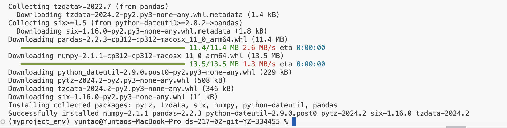

#Assignment 1

## Method 1
### Find the largest multiple of 3,5 and 15 below 1000
largest_multiple_of_3 = 999 - (999 % 3)
largest_multiple_of_5 = 999 - (999 % 5)
largest_multiple_of_15 = 999 - (999 % 15)

### Calculate the sum of all multiples of 3,5 and 15 below 1000
### Sum of an arithmetic series: n/2 * (first_term + last_term)
sum_multiple_of_3 = ((largest_multiple_of_3 + 3)/2)*(largest_multiple_of_3/3)
sum_multiple_of_5 = ((largest_multiple_of_5 + 5)/2)*(largest_multiple_of_5/5)
sum_multiple_of_15 = ((largest_multiple_of_15 + 15)/2)*(largest_multiple_of_15/15)

# As 3 and 5 are both prime number, sum of all there multiples are equal to
# sum of the multiples of them each minus the sum of the multiples of their
# least common multiple
print (sum_multiple_of_3 + sum_multiple_of_5 - sum_multiple_of_15)

## Method 2
Sum = 0

for i in range(1000):
    if i % 3 ==0 or i % 5 ==0:
        Sum += i

print (Sum)

This is [Official python website](https://www.python.org)

Meme: Life Is Like the Ocean